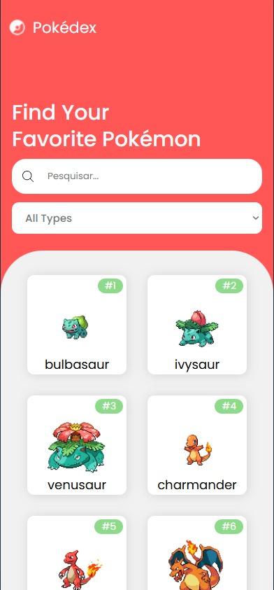
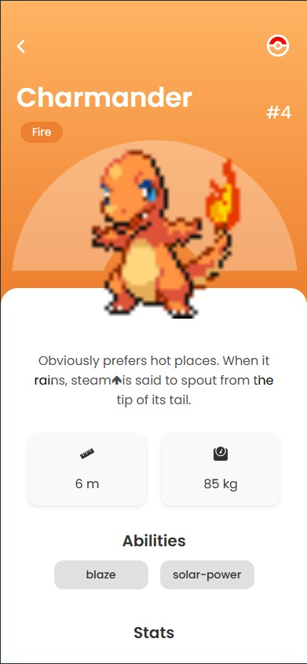
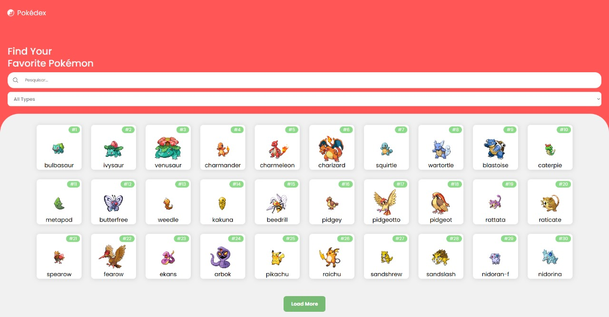

# Pokédex

A simple Pokédex built with **React + TypeScript**, fetching data from the [PokéAPI](https://pokeapi.co/).

## 🚀 Features
- List of Pokémon with names and images
- Fetches data dynamically from the PokéAPI
- Dark/Light theme support
- Responsive design

## 🛠 Technologies Used
- **React** (with hooks)
- **TypeScript**
- **Styled-Components** (for styling)
- **React Router** (for navigation)
- **Fetch API** (to get data from PokéAPI)

## 📦 Installation

### 1️⃣ Clone the Repository
```sh
git clone https://github.com/your-username/pokedex.git
cd pokedex
```

### 2️⃣ Install Dependencies
```sh
npm install
```

### 3️⃣ Start the Project
```sh
npm run dev
```
The application will be available at `http://localhost:5173` (or a similar port).

## 📂 Project Structure
```
.
├── src
│   ├── components      # UI components (e.g., PokeCard)
│   ├── pages           # Page components (e.g., Home, Details)
│   ├── services        # API calls (getPokemonApi, getPokemonDetails)
│   ├── styles          # Global styles
│   ├── App.tsx         # Main application component
│   ├── main.tsx        # Entry point
│   ├── routes.tsx      # React Router setup
│   └── types.ts        # TypeScript interfaces
└── README.md
```

## 📌 API Reference
We use [PokéAPI](https://pokeapi.co/) to retrieve Pokémon data.

Example API call:
```ts
const response = await fetch("https://pokeapi.co/api/v2/pokemon?limit=20");
const data = await response.json();
console.log(data.results); // List of Pokémon
```

## 📝 Contributing
Feel free to fork this repository and submit pull requests.

### Steps to Contribute:
1. **Fork** the repository
2. **Create a new branch** (`feature-new-component`)
3. **Commit your changes** (`git commit -m 'Add new feature'`)
4. **Push to the branch** (`git push origin feature-new-component`)
5. **Submit a pull request** 🚀

---
Happy coding! 🎉
## 📸 Preview

### Mobile Version




### Desktop Version



